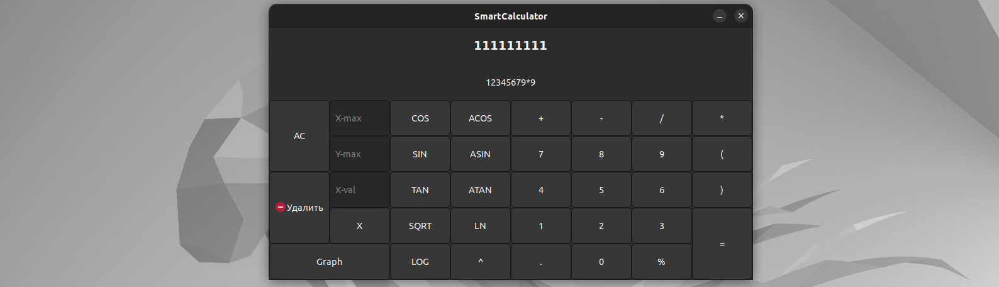

 <br/>

# SmartCalc_V1

SMARTCALC_V1.0 - это удобная утилита, созданая при помощи фреймворка GTK+3.0. Данный калькулятор имеет функцию отрисовки графиков.

### Программа, представляет собой многофункциональный калькулятор, включающий в себя множество математических функций. 

<br/><br/>

### **Основные функции калькулятора:**
<br/>

| Название оператора | Запись |
| ------ | ------ |
| Скобки | (a + b) |
| Сложение | a + b |
| Вычитание | a - b |
| Умножение | a * b |
| Деление | a / b |
| Возведение в степень | a ^ b |
| Остаток от деления | a % b |

<br/>

### **Дополнительные функции:**

<br/>

| Описание функции | Функция |   
| ---------------- | ------- |  
| Вычисляет косинус | cos(x) |   
| Вычисляет синус | sin(x) |  
| Вычисляет тангенс | tan(x) |  
| Вычисляет арккосинус | acos(x) | 
| Вычисляет арксинус | asin(x) | 
| Вычисляет арктангенс | atan(x) |
| Вычисляет квадратный корень | sqrt(x) |
| Вычисляет натуральный логарифм | ln(x) | 
| Вычисляет десятичный логарифм | log(x) |

<br/>

### **Как пользоваться:**

<br/>

```
-Запуск при помощи стандартных целей Makefile
-Все кнопки на экране активны
-Чтобы вычислить выражение, вам нужно нажать на кнопку "="
-Чтобы нарисовать график, вам нужно вести выражение и нажвать кнопку "Graph"
-В окнах (X-max, Y-max) вы можете изменить масштаб координатных осей (по умолчанию значение равно 10)
```

<br/>

 <br/>

<br/>

### **Рекомендация:**

<br/>

```
Не вводите недопустимые значения 
```